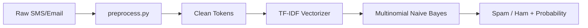

# 🛡️ AI Spam Mail Detector

A **production-ready**, beginner-friendly web application that classifies **emails**, **SMS messages**, and user-entered text as **Spam** or **Not Spam (Ham)** using **Machine Learning**, **NLP**, and a modern **Streamlit** interface.


---

## ✨ Features

### Core
- Classify emails, SMS, and free-form text
- Paste text or upload `.txt` files
- **Spam / Ham** prediction with **confidence percentage**
- **Spam score meter** (progress bar)
- **Suspicious keyword** detection and highlighting
- **Prediction history** in the sidebar
- **Clear / Reset** controls

### Advanced
- **Phishing URL detection** (short links, multiple URLs, risky phrases)
- **AI-style explanation** of each prediction
- **Word importance** chart (TF-IDF × Naive Bayes signals)
- Animated loading spinner during analysis
- **Analytics dashboard** with pie charts and session stats
- **Download prediction report** (CSV)
- **Multilingual script hints** (English model with Devanagari/CJK/Arabic detection)
- Dark **cybersecurity-themed** responsive UI

---

## 🛠️ Tech Stack

| Layer | Technology |
|--------|------------|
| Frontend | [Streamlit](https://streamlit.io/) |
| Backend | Python 3.10+ |
| ML | scikit-learn (TF-IDF + Multinomial Naive Bayes) |
| NLP | NLTK (tokenization, stopwords, Porter stemming) |
| Data | pandas, numpy |
| Charts | Plotly |
| Persistence | pickle |

---

## 📸 Screenshots

Add your app screenshots to the `screenshots/` folder:

```
screenshots/
├── home.png
├── result-spam.png
├── result-ham.png
└── analytics.png
```

Run the app locally, capture screens, and reference them here in your portfolio README.

---

## 📁 Project Structure

```
spam-mail-detector/
│
├── app.py                 # Streamlit web application
├── train_model.py         # Model training script
├── preprocess.py          # NLP preprocessing pipeline
├── requirements.txt     # Python dependencies
├── README.md
├── model.pkl              # Trained classifier (generated)
├── vectorizer.pkl         # TF-IDF vectorizer (generated)
│
├── dataset/
│   └── spam.csv           # SMS Spam Collection dataset
│
├── assets/
│   └── styles.css         # Custom dark theme styles
│
├── screenshots/           # App screenshots for README
│
└── .streamlit/
    └── config.toml        # Streamlit theme configuration
```

---

## 🧠 ML Workflow



1. **Load** `dataset/spam.csv` (Kaggle SMS Spam Collection)
2. **Map** labels: `spam → 1`, `ham → 0`
3. **Preprocess** each message (lowercase, remove punctuation/numbers, stopwords, stemming)
4. **Split** 80/20 train/test (stratified)
5. **Vectorize** with TF-IDF (max 5000 features, unigrams + bigrams)
6. **Train** Multinomial Naive Bayes
7. **Evaluate** accuracy, precision, recall, F1
8. **Save** `model.pkl` and `vectorizer.pkl`

**Expected accuracy:** 96%–99% on the test split.

---

## 🚀 Installation

### Prerequisites
- Python **3.10** or newer
- pip
- Git (optional)

### 1. Clone or download the project

```bash
git clone https://github.com/YOUR_USERNAME/spam-mail-detector.git
cd spam-mail-detector
```

### 2. Create a virtual environment (recommended)

**Windows (PowerShell):**
```powershell
python -m venv venv
.\venv\Scripts\Activate.ps1
```

**macOS / Linux:**
```bash
python3 -m venv venv
source venv/bin/activate
```

### 3. Install dependencies

```bash
pip install -r requirements.txt
```

### 4. Download NLTK data (first run)

NLTK resources are downloaded automatically when you run training or the app. If needed manually:

```bash
python -c "import nltk; nltk.download('punkt'); nltk.download('punkt_tab'); nltk.download('stopwords')"
```

### 5. Train the model

```bash
python train_model.py
```

You should see evaluation metrics printed in the terminal and `model.pkl` + `vectorizer.pkl` created in the project root.

### 6. Run the app locally

```bash
streamlit run app.py
```

Open the URL shown in the terminal (usually **http://localhost:8501**).

---

## 📖 Usage

1. Enter or paste message text in the text area, **or** upload a `.txt` file.
2. Click **Detect Spam**.
3. Review:
   - Prediction label (Spam / Not Spam)
   - Confidence and spam score meter
   - Phishing warnings (if any)
   - Highlighted suspicious words
   - Word importance chart
   - AI explanation
4. Use the **Analytics Dashboard** in the sidebar for session statistics.
5. **Download Report** from the sidebar to export history as CSV.

### Example spam message

```
Congratulations!!! You won $1000 prize. Click here to claim now. Limited offer!
```

### Example ham message

```
Hey, are we still meeting for lunch tomorrow at noon?
```

---

## ☁️ Deployment

### Streamlit Community Cloud

1. Push the project to GitHub (include `requirements.txt`, `app.py`, and trained `model.pkl` / `vectorizer.pkl`, or run training in CI).
2. Go to [share.streamlit.io](https://share.streamlit.io/).
3. Connect your repo, set **Main file path** to `app.py`.
4. Deploy.

> **Tip:** For Cloud deploy, commit `model.pkl` and `vectorizer.pkl` after local training, or add a `packages.txt` / startup script to train on first boot (slower).

### Render

1. Create a new **Web Service** on [render.com](https://render.com).
2. Build command: `pip install -r requirements.txt && python train_model.py`
3. Start command: `streamlit run app.py --server.port=$PORT --server.address=0.0.0.0`
4. Add environment variable if needed; use Python 3.10+.

### Railway

1. New project from GitHub repo on [railway.app](https://railway.app).
2. Use a `Procfile` or set start command:

```
web: streamlit run app.py --server.port=$PORT --server.address=0.0.0.0
```

3. Ensure `requirements.txt` is at the repo root.

### Optional: `Procfile` for Render/Railway

```
web: streamlit run app.py --server.port=${PORT:-8501} --server.address=0.0.0.0 --server.headless=true
```

---

## 🔮 Future Improvements

- [ ] Fine-tune with email-specific datasets (Enron, SpamAssassin)
- [ ] Deep learning models (LSTM, DistilBERT)
- [ ] True multilingual models per language
- [ ] REST API (FastAPI) for integrations
- [ ] Gmail/Outlook plugin
- [ ] User feedback loop to retrain on corrections
- [ ] Docker containerization

---

## 📄 License

This project is released under the **MIT License**. You are free to use, modify, and distribute it for learning and portfolio purposes.

---

## 👤 Author

Built as a resume-worthy, beginner-friendly ML + NLP portfolio project.

**Happy coding — stay safe from spam! 🛡️**
