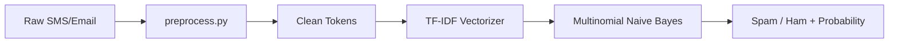

# 🛡️ AI Spam Mail Detector

A **production-ready**, beginner-friendly web application that classifies **emails**, **SMS messages**, and user-entered text as **Spam** or **Not Spam (Ham)** using **Machine Learning**, **NLP**, and a modern **Streamlit** interface.


---

## ✨ Features

### Core
- Classify emails, SMS, and free-form text
- Paste text or upload `.txt` files
- **Spam / Ham** prediction with **confidence percentage**
- **Spam score meter** (progress bar)
- **Suspicious keyword** detection and highlighting
- **Prediction history** in the sidebar
- **Clear / Reset** controls

### Advanced
- **Phishing URL detection** (short links, multiple URLs, risky phrases)
- **AI-style explanation** of each prediction
- **Word importance** chart (TF-IDF × Naive Bayes signals)
- Animated loading spinner during analysis
- **Analytics dashboard** with pie charts and session stats
- **Download prediction report** (CSV)
- **Multilingual script hints** (English model with Devanagari/CJK/Arabic detection)
- Dark **cybersecurity-themed** responsive UI

---

## 🛠️ Tech Stack

| Layer | Technology |
|--------|------------|
| Frontend | [Streamlit](https://streamlit.io/) |
| Backend | Python 3.10+ |
| ML | scikit-learn (TF-IDF + Multinomial Naive Bayes) |
| NLP | NLTK (tokenization, stopwords, Porter stemming) |
| Data | pandas, numpy |
| Charts | Plotly |
| Persistence | pickle |

---

## 📸 Screenshots

Add your app screenshots to the `screenshots/` folder:

```
screenshots/
├── home.png
├── result-spam.png
├── result-ham.png
└── analytics.png
```

Run the app locally, capture screens, and reference them here in your portfolio README.

---

## 📁 Project Structure

```
spam-mail-detector/
│
├── app.py                 # Streamlit web application
├── train_model.py         # Model training script
├── preprocess.py          # NLP preprocessing pipeline
├── requirements.txt     # Python dependencies
├── README.md
├── model.pkl              # Trained classifier (generated)
├── vectorizer.pkl         # TF-IDF vectorizer (generated)
│
├── dataset/
│   └── spam.csv           # SMS Spam Collection dataset
│
├── assets/
│   └── styles.css         # Custom dark theme styles
│
├── screenshots/           # App screenshots for README
│
└── .streamlit/
    └── config.toml        # Streamlit theme configuration
```

---

## 🧠 ML Workflow


```mermaid
flowchart LR
    A[Raw SMS/Email] --> B[preprocess.py]
    B --> C[Clean Tokens]
    C --> D[TF-IDF Vectorizer]
    D --> E[Multinomial Naive Bayes]
    E --> F[Spam / Ham + Probability]
```

1. **Load** `dataset/spam.csv` (Kaggle SMS Spam Collection)
2. **Map** labels: `spam → 1`, `ham → 0`
3. **Preprocess** each message (lowercase, remove punctuation/numbers, stopwords, stemming)
4. **Split** 80/20 train/test (stratified)
5. **Vectorize** with TF-IDF (max 5000 features, unigrams + bigrams)
6. **Train** Multinomial Naive Bayes
7. **Evaluate** accuracy, precision, recall, F1
8. **Save** `model.pkl` and `vectorizer.pkl`

**Expected accuracy:** 96%–99% on the test split.

---


### Example spam message

```
Congratulations!!! You won $1000 prize. Click here to claim now. Limited offer!
```

### Example ham message

```
Hey, are we still meeting for lunch tomorrow at noon?
```

---


## 🔮 Future Improvements

- [ ] Fine-tune with email-specific datasets (Enron, SpamAssassin)
- [ ] Deep learning models (LSTM, DistilBERT)
- [ ] True multilingual models per language
- [ ] REST API (FastAPI) for integrations
- [ ] Gmail/Outlook plugin
- [ ] User feedback loop to retrain on corrections
- [ ] Docker containerization

---

## 📄 License

This project is released under the **MIT License**. You are free to use, modify, and distribute it for learning and portfolio purposes.

---

## 👤 Author

Built as a resume-worthy, beginner-friendly ML + NLP portfolio project.

**Happy coding — stay safe from spam! 🛡️**
